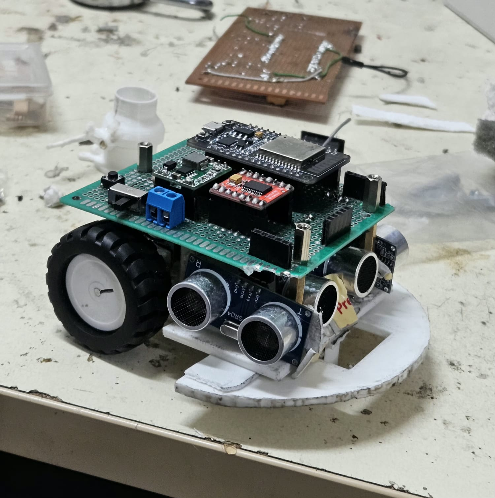

# Micromouse Maze Solver Bot

 
*(A placeholder for your amazing robot's photo!)*

This repository contains the complete codebase, 3D chassis design, and hardware documentation to build a fully autonomous Micromouse maze-solving robot. Built on an **ESP32** utilizing **C++** and **PlatformIO**, this project implements complex embedded systems concepts including custom **PID control algorithms**, hardware interrupt-based encoder reading, and real-time state machine logic. 

The robot autonomously maps an unknown maze utilizing the **Flood Fill algorithm**, dynamically calculates the optimal path, and executes a precision high-speed run to the center goal.

## 🌟 Key Features & Technical Highlights
* **Dynamic Pathfinding (Graph Theory & DP):** Uses the Flood Fill algorithm to dynamically calculate the **shortest path**. It treats the maze as a grid graph and uses Dynamic Programming principles to update path weights in real-time as new walls are discovered.
* **Highly Efficient Edge Computing:** The pathfinding and mapping algorithms are heavily optimized to run locally on the ESP32 (an edge device), ensuring zero lag between sensor inputs, path recalculations, and motor control.
* **Proportional-Integral-Derivative (PID) Control:** Uses a custom-tuned PID control loop to automatically adjust motor speeds, keeping the robot perfectly centered between maze walls at high speeds.
* **Hardware Interrupts for Precision Odometry:** Uses fast hardware interrupts to read wheel encoders, ensuring the robot turns exactly 90°/180° and moves cell-by-cell with extreme accuracy.
* **Robust State Machine:** Uses a Finite State Machine (FSM) to smoothly transition the robot from mapping the maze (Exploration Mode) to racing to the center (Speed Run Mode).

##  How the Software Works
The robot's brain works in a continuous 3-step loop: **Look, Think, and Move**.

1. **Look (Sense):** The robot checks its surroundings. It uses 3 ultrasonic sensors to "see" walls and rotary encoders on the wheels to track exactly how far it has traveled.
2. **Think (Plan):** The robot updates its internal map with newly discovered walls. It then runs the **Flood Fill algorithm** to calculate the shortest path to the center of the maze.
3. **Move (Act):** The robot drives forward or turns based on its plan. While driving straight, a **PID controller** makes tiny, automatic speed adjustments to both wheels to keep the robot perfectly centered and prevent wall collisions.

##  Repository Structure
- `/src` - The main C++ source code (PlatformIO / Arduino compatible).
- `/hardware` - 3D print `.stl` files for the chassis.
  - [Download Chassis STL](hardware/chassis.stl)
- `/docs` - Documentation, including demo videos and photos.
  - [Watch Demo Video](docs/demo_video.mp4)

---

## Components List
To build this robot, you will need the following components:
1. **Microcontroller:** ESP32 Development Board (ESP32 DOIT DevKit V1)
2. **Motor Driver:** TB6612FNG Motor Driver Module
3. **Motors:** 2x N20 DC Gear Motors(150 RPM preferred) with built-in quadrature encoders
4. **Sensors:** 3x HC-SR04 Ultrasonic Sensors (Front, Left, Right)
5. **Chassis:** 3D Printed Chassis (see `/hardware/chassis.stl`)
6. **buck converter:** Mini 360 DC-DC Buck Converter
7. **Power:** 2x 18650 Li-ion Batteries (7.4V) and Battery Holder
8. **pcb:** 8cmx12cm Perfboard
9. **Misc:** 1x Push Button, 1x 10k Resistor (for button pull-down), Jumper wires, Breadboard/PCB(optional).

---

## 🔌 Hardware Connections (Pinout)

Ensure your components are wired to the ESP32 according to this table , you can make the pcb as per your need.

| Component | Pin Function | ESP32 Pin |
| :--- | :--- | :--- |
| **Push Button** | Start/Mode Button | `GPIO 34` (Use external 10k pull-down) |
| **Front Sonar** | Trig / Echo | `GPIO 14` / `GPIO 27` |
| **Left Sonar** | Trig / Echo | `GPIO 33` / `GPIO 32` |
| **Right Sonar** | Trig / Echo | `GPIO 25` / `GPIO 26` |
| **Motor Driver** | ENA (Left PWM) | `GPIO 23` |
| | IN1 / IN2 (Left Dir) | `GPIO 5` / `GPIO 22` |
| | ENB (Right PWM) | `GPIO 18` |
| | IN3 / IN4 (Right Dir) | `GPIO 21` / `GPIO 19` |
| **Left Motor** | Encoder A (Interrupt) | `GPIO 13` |
| **Right Motor** | Encoder A (Interrupt) | `GPIO 4` |

---

##  Step-by-Step Build Guide

### Step 1: 3D Print the Chassis
Navigate to the `hardware/` folder and use your slicer software to print the `chassis.stl` file. PLA or PETG works perfectly.

### Step 2: Mount the Hardware
1. Attach the two DC gear motors with encoders to the bottom of the chassis.
2. Mount the 3 Ultrasonic sensors (Front, Left, Right) to the front brackets of the chassis.
3. Secure the ESP32 and the  motor driver onto the top deck.
4. Add the battery pack at the rear for optimal weight distribution.

### Step 3: Wire the Electronics
Follow the Pinout table above. Ensure that the ground of the motor driver is tied together with the ESP32 ground. Connect the battery directly to the motor driver's motor power input (VMOT/12V), and route the Buck Converter output to power the ESP32 with a clean 5V (via the 5V/VIN pin).

### Step 4: Flash the Code
1. Open this folder in VS Code with the **PlatformIO** extension installed.
2. The `platformio.ini` is already configured for the ESP32 with `monitor_speed = 115200`.
3. Connect your ESP32 via USB and click **Upload**.

### Step 5: Test and Run
1. Place the robot in the starting square `(0,0)` facing North.
2. Turn on the power.
3. Press the Start Button (Pin 34). The robot will wait 1 second and then begin its **Exploration Run**.
4. Once it reaches the goal, it will stop. Press the button again to execute the **Speed Run**.

---

##  Practical Tuning Guide

Achieving a perfect maze run requires precise tuning of your robot's physical constants. Here is how to calibrate the vital parameters in `main.cpp`.

### 1. How to Calculate Encoder Pulses for Your Motors

In the code, the robot moves forward one cell using the variable `countsPerCell`. To find this exact number, use the following math:

**Formula:**
1. Find your **Wheel Circumference (C)**: `C = Diameter * 3.14159`
2. Find your **Distance Per Count**: `Dist_Per_Count = C / Motor_CPR (Counts Per Revolution)`
3. Calculate **Counts Per Cell**: `Counts = Target_Distance / Dist_Per_Count`

**Example calculation:**
* **Wheel diameter:** 3.4 cm (Circumference = 10.68 cm)
* **Motor CPR:** 120 pulses per revolution of the wheel shaft.
* **Distance Per Count:** `10.68 / 120 = 0.089 cm per count`
* **Standard Maze Cell:** 18.0 cm (Target Distance)
* **Resulting `countsPerCell`:** `18.0 / 0.089 = 202 counts`.

> ** Pro Tip:** Theoretical math gets you close, but tire slip changes things. Set `countsPerCell = 202`, let the robot drive one cell, and measure. If it drives 17cm, increase the counts slightly.

### 2. How to Tune 90° and 180° Turns

The variable `countsFor90DegTurn` determines how long the wheels spin in opposite directions to rotate the chassis in place. 

**Theoretical Formula:**
1. Measure your robot's **Track Width (W)** (the distance between the center of the left and right wheels).
2. The robot turns in a circle with diameter W. The **Turn Circumference** is `W * 3.14159`.
3. A 90-degree turn is exactly 1/4th of that circumference: `Arc_Distance = Turn_Circumference / 4`.
4. **`countsFor90DegTurn`** = `Arc_Distance / Dist_Per_Count`.

**How to Practically Tune It:**
No theoretical calculation will be 100% perfect for turning because wheels drag sideways when pivoting.
1. **Start with the theoretical math.** (e.g., if track width is 8.5cm, 90° arc is ~6.6cm. `6.6 / 0.089 = 74 counts`).
2. **Write a test script:** Modify your `loop()` to simply call `turnRight90(); delay(2000);` endlessly.
3. **Observe and Adjust:** Place the robot on a tile line. If it over-rotates (e.g. 95 degrees), reduce `countsFor90DegTurn` by 2-3 counts. If it under-rotates, increase it.
4. **The 180° Turn:** The code handles 180-degree turns by simply doubling the 90-degree counts (`countsFor90DegTurn * 2`). As long as your 90-degree turn is perfectly calibrated, the 180-degree turn will work flawlessly!
5. **Momentum matters:** If your robot jerks and overshoots after stopping, keep the `delay(50)` after the `stopMotor()` command in the turning functions to allow momentum to settle before taking new sensor readings.

all the best
